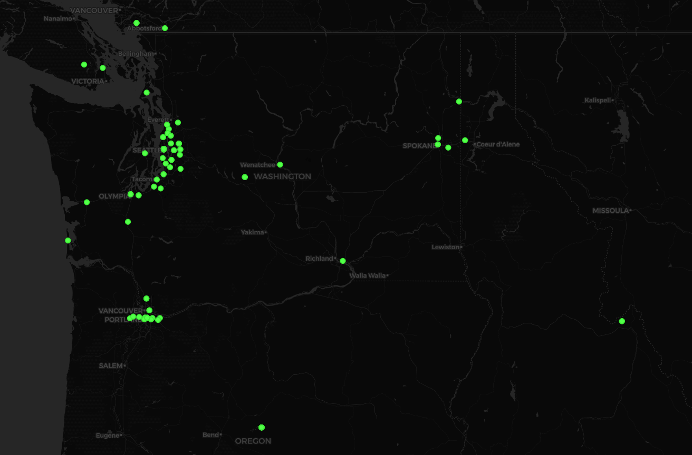
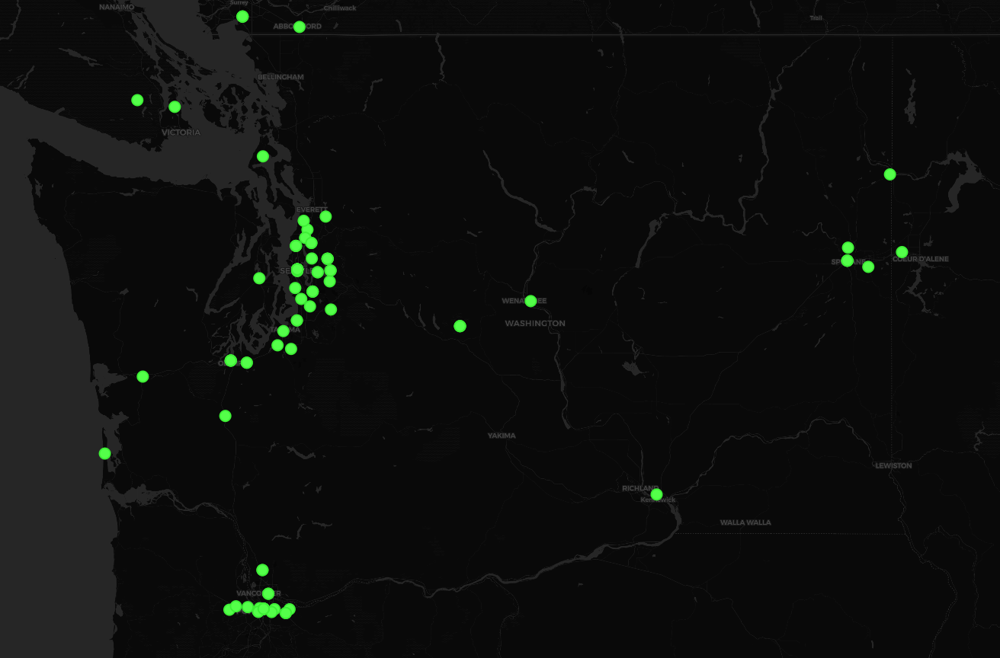

# Washington State Tweets

## 1. Introduction

This project was created to practice visualizing geo-tagged tweets found using a Twitter web crawler.

First a stream using the Twitter Crawler API was set up to listen for and process geo-tagged tweets. The stream was run for 5 minutes and tweets were filtered based on location (Washington State) and output into a csv file upon completion. Finally, the csv was imported into QGIS and displayed on a map. The next section displays this map and thoughts about the meaning of the trends.

_This project was created for GEOG 458 with Bo Zhao at the University of Washington_

## 2. Results and Thoughts

Tweets Gathered: **135**
Run Time: **5 minutes**

Tweets gathered into a csv are represented by the green dots based on their latitude and longitude attributes. They were imported as a layer into QGIS and a basemap was added.

<pre></pre>
However, we can see that there are a couple of tweets way outside of Washington State boundary. For now, we can assume that these are errors and we will zoom in to just those points within Washinton State (_at least very close to being within_).
<pre></pre>

What can we learn from this? There isn't much that we can say confidently, but we can acknowledge objective observations and make some inferences. Based on (_a small number of_) recent tweets in Washington State it is clear where there are large populations and how concentrated these individuals are. We can see a _relatively_ large number of tweets in Seattle and along the Puget Sound, Vancouver, and Spokane. One observation we may make is that Vancouver seems to tweets more than Seattle when looking at the ratios of tweets to population. Based on population, Seattle (population: ~750,000) should have about **4 times more** tweets than Vancouver (population: ~185,000). We can also see that the tweets in Vancouver are dense or overlapping compared to that of Seattle.

All in all, a much larger amount of data would be required to learn more about the tweeting habits in Washington State.

---
### Notes and Limitations:

**Boundary -**
It is important to understand the discrepency when using a boundary box. While I intended to only gather tweets from Washington State, I instead have other tweets. Because the following four coordinates were used, **[-124.763068, 45.543541, -116.915989, 49.002494]** (Found at [this website](https://anthonylouisdagostino.com/bounding-boxes-for-all-us-states/)), the boundary does not conform to the real world shape of Washington State, but rather a box. Taking a look at one of the tweets gathered, I found that it was geo-tagged in Hillsboro, Oregon because of this undetailed edge.

**Time and Filter -**
As specificity increases with our filter that we use, the harder it is to gather large amounts of data in a small time frame. Had I left the filter to contain the entire United States, I would have had many more tweets in my csv file. Using a more specific boundary box I had run the code for 5 minutes rather than 1. To get more data more representative of Washington State's tweeting patterns, we would have to run the stream for a longer time frame.
